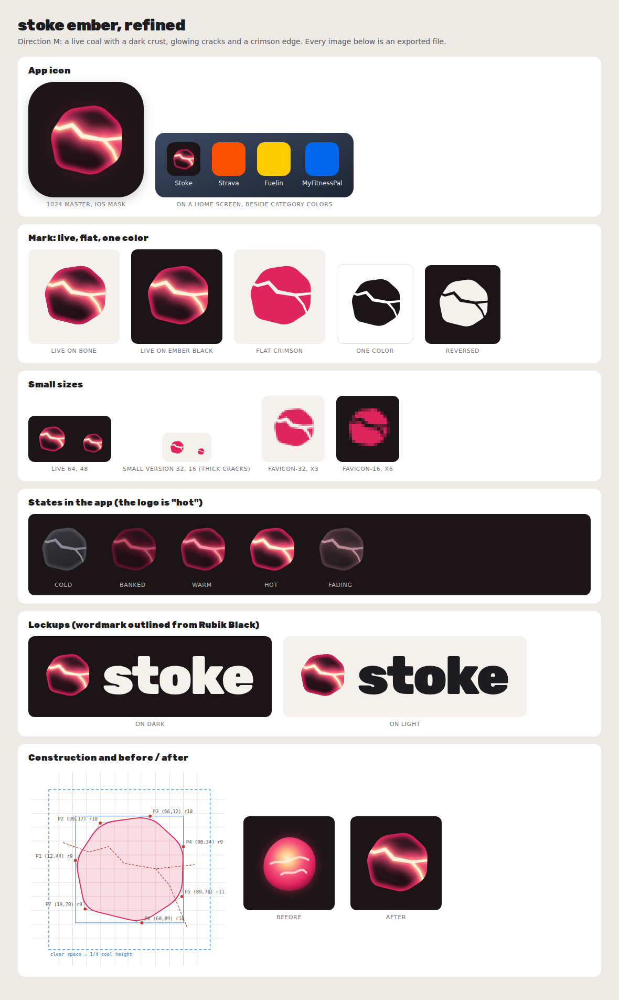

# Stoke Ember: Logo Spec and Finishing Guide

**Status (6 October 2026): refined direction, ready for a designer's final pass.** The mark below replaces the placeholder in the strategy report. It is not final until three things happen: a recognition test with users, a figurative trademark search, and the optical polish described in "How to Finish It."

## The Idea

A live coal: a dark crust with white-hot cracks and a crimson edge. It is the brand's visual hammer from doc 4 (the Ember), drawn the way a real ember looks. Small, regular stokes keep a coal glowing, which is what a habit is; the cracks are where the heat shows.

The placeholder failed because it was a near-circle with two parallel wavy lines. It read as a pink ball, a water symbol (≈) or, at small sizes, a notification dot.

Lookalikes found and designed out across four rounds of exploration:

| Rejected Shape | Read As |
|----------------|---------|
| Round coal, sphere shading | Ball, planet, peach |
| Coal split by one seam | Coffee bean |
| Tapered coal, horizontal crack | Muffin; in pink, a slice of ham |
| Wide coal, horizontal crack | Lips |
| Small sizes, horizontal bar | No-entry sign |
| Small sizes, diagonal slash | Prohibition sign |

## Files

| File | Use |
|------|-----|
| `stoke-ember.svg`, `stoke-ember-1024.png` | **Primary mark (live).** Digital use at 48 px and above, on light or dark |
| `stoke-app-icon.svg`, `stoke-app-icon-1024.png` | App icon master: square, no rounded corners (iOS and Android apply their own masks) |
| `stoke-ember-flat.svg`, `stoke-ember-flat-512.png` | Flat crimson: print, merchandise, stamps, embroidery |
| `stoke-ember-small.svg`, `favicon-32.png`, `favicon-16.png` | Small sizes (16-40 px): thickened cracks |
| `stoke-ember-black.svg`, `stoke-ember-white.svg` | One color: black on light, Bone on dark |
| `stoke-lockup-on-dark.svg/.png`, `stoke-lockup-on-light.svg/.png` | Mark plus wordmark (letters outlined, no font needed) |
| `states/stoke-ember-{cold,banked,warm,hot,fading}.svg` | In-app states; the logo is "hot" |
| `stoke-ember-construction.svg` | Construction drawing on the 100-unit grid |
| `stoke-ember-overview.png` | One-page overview of everything above, with the placeholder for comparison |
| `source/build_logo.py`, `source/export_png.js` | Regenerate every file above from the parameters in this spec (usage in the script header) |

## Construction (100-Unit Grid)

**Silhouette:** seven vertices, each corner rounded with a cubic curve whose handles sit 62% of the way toward the vertex.

| Vertex | P1 | P2 | P3 | P4 | P5 | P6 | P7 |
|--------|----|----|----|----|----|----|----|
| Position | (12, 44) | (30, 17) | (66, 12) | (90, 34) | (89, 70) | (60, 89) | (19, 79) |
| Corner radius | 9 | 10 | 10 | 9 | 11 | 10 | 9 |

**Cracks:** two tapered ribbons drawn along centerlines, with true miter joins (miter limit 2.4). Both run past the edge and are clipped by the silhouette.

- Main crack: (3, 31) → (22, 38) → (36, 34) → (47, 46) → (70, 50) → (99, 47). Widths 2.4, 3.8, 4.4, 5.0, 4.0, 2.4.
- Fork: (70, 50) → (80, 62) → (93, 93). Widths 3.6, 2.8, 1.8.
- The fork meets the main crack at an off-center point, as real secondary cracks do. Never move it to the middle, where the pair reads as a letter (T or Y).
- Small version (16-40 px): the same centerlines, with the main crack's widths multiplied by 1.8 and the fork's by 1.9.

**Bounding box:** the coal spans x 12-90 and y 12-89. Center it optically on that box, not on the 100-unit square.

## Color and Rendering

| Token | Hex | Where |
|-------|-----|-------|
| Stoke Crimson | #E0245E | The coal's glowing edge; flat version; primary actions elsewhere |
| Crust Top / Crust Base | #3B1B26 / #1E0F14 | Inside the coal only: a gradient from the top-left to the base |
| Crimson Bloom | #FF4D7D | Inside the coal only: the glow around the cracks |
| Core Glow | #FFC98A | Inside the coal only: the inner glow along the cracks |
| White Heat | #FFF1DC | The cracks themselves |
| Ember Black | #1C1517 | App icon tile and dark backgrounds |
| Bone / Coal Text | #F4F1EC / #1C1C21 | Wordmark on dark / on light |

Doc 4's rule holds: Core Glow, Crimson Bloom and White Heat never appear outside the ember.

**Live version, layer order (blur radii in grid units, clipped to the silhouette):**
1. Crust gradient fill.
2. Edge glow: a Crimson stroke 9 units wide on the silhouette, blur 2.6, opacity 95%.
3. Crack bloom: a Crimson Bloom stroke 20 units wide along each centerline, blur 5.5, opacity 90%.
4. Crack core: a Core Glow stroke 7 units wide, blur 2, opacity 95%.
5. Cracks filled with White Heat.

**App icon:** an Ember Black tile with a soft Crimson radial glow behind the coal (30% opacity at the center, 9% at 55% of the radius, fading to 0 at 44% of the tile width). The coal's height is 62% of the tile, centered.

## Lockup

- **Wordmark:** "stoke," lowercase, in Rubik Black (weight 900), tracked to -35/1000 em, kerned, and outlined. Rubik is under the SIL Open Font License, which permits use in a logo.
- **Proportion:** the coal is 1.15 times the height of the ascenders (t and k). The gap between mark and word is 30% of the coal's height.
- **Alignment:** the coal is vertically centered on the ascender band.
- **Clear space:** one quarter of the coal's height on every side, for the mark alone and for the lockup.
- **Minimum sizes:**
  - Live mark: 48 px.
  - Small version: 16 px.
  - Lockup: 120 px wide on screen, 30 mm in print.

## States in the App

| State | Crust | Edge | Cracks | Meaning (doc 4) |
|-------|-------|------|--------|-----------------|
| Hot (the logo) | #3B1B26 to #1E0F14 | Crimson, 95% | White Heat with Crimson Bloom | The next key session is fueled |
| Warm | #35191F to #1E0F14 | Crimson, 70% | #FF8FA9, softer bloom | The day is on track |
| Banked | #2C161C to #1B0E12 | #9E1645, 55% | #C2486B, faint bloom | Rest day |
| Cold | #3A3A40 to #25252A | #6B6B73, 50% | #8B8B94, no glow | Short of what the next session needs |
| Fading | #3A2C31 to #241B1F | #8E5A6A, 45% | #B98A97, faint bloom | Energy Floor: several hard days with small meals |

Cold is gray, never red, and every state is paired with words in the app ("You're set," "Add a snack before tomorrow's intervals").

## Don'ts

- Don't add sparks to the static mark. The three sparks belong to the stoke animation.
- Don't add a flame tongue or a point. A flame stands for "calories burned."
- Don't use the live version below 48 px. Use the small version.
- Don't recolor outside the tokens, outline the coal, rotate it, skew it or set it on a busy photo without the Ember Black tile.
- Don't let the cracks become symmetric, horizontal or centered. Those moves bring back the muffin, the lips and the no-entry sign.
- Don't use crimson for errors anywhere in the product (doc 4).

## How to Finish It

For a designer, or for anyone working in Figma or Illustrator:

1. **Open the master.** Import `stoke-ember.svg` and `stoke-ember-construction.svg`. Both are on the 100-unit grid.
2. **Polish optically.**
   - Smooth the silhouette's corners to continuous curvature (G2), and taper the cracks more sharply toward their tips.
   - Fine-tune the fork's angle.
   - Keep every vertex within 2 units of the spec, so the lookalike checks above still hold.
3. **Rebuild the glow natively.** Use layer blur in Figma or the Gaussian Blur effect in Illustrator, following the five-layer recipe.
4. **Make the wordmark ownable.** Start from the outlined Rubik Black and customize one or two letters (for example, a sharper cut on the k's arm or a tighter spine on the s). Then re-kern. A stock typeface is weaker as a trademark than a modified one.
5. **Export platform sets.**
   - **iOS:** the 1024 px square, opaque. If you use Apple's Icon Composer, put the coal on its own layer above an Ember Black background, so the system's dark and tinted appearances work. Use the one-color mark for tinted.
   - **Android:** an adaptive icon, with the coal as the foreground inside the 66 dp safe zone of the 108 dp canvas and Ember Black plus the glow as the background. Add a themed (monochrome) icon from `stoke-ember-white.svg`.
   - **Web:** favicon.ico (16 and 32), a 180 px apple-touch icon, and 192 and 512 px PWA icons.
   - **Social:** a 400 × 400 avatar, with the coal inside the central 70% so circular crops keep it whole.
6. **Animate the stoke** (doc 4). Use a breath (scale 1.00 to 1.04 and back), a brighter bloom, and three sparks rising from the fork, in under one second. Provide a reduced-motion version that only brightens.

## Tests

**Done (6 October 2026):**
- Rendered at 1024, 64, 48, 32 and 16 px on light and dark, in one color and reversed, and beside category colors on a home screen.
- Ran the lookalike review above.

**Still to run before launch:**
1. **Five-second test:** show the icon to 10-15 target users and ask "What is this?" Pass if most answers are coal, ember, rock or fire. Fail on food answers, since this is a food app.
2. **Shelf test:** check recognition at 16 px, in a row of real favicons and app icons.
3. **Figurative trademark search:** search the device-mark registers for coal, stone and fire devices in the US, EU and UK (classes 9, 42 and 44), alongside the word mark clearance in doc 2.
4. **Contrast in context:** check the cold and fading states on the app's real screens. They must stay distinguishable without relying on color alone.
